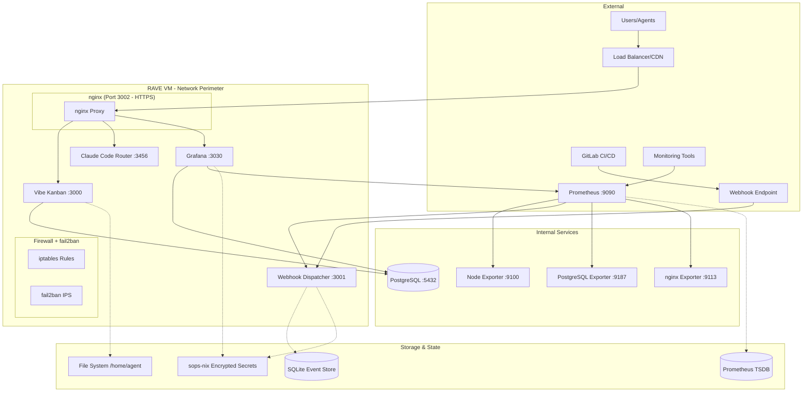
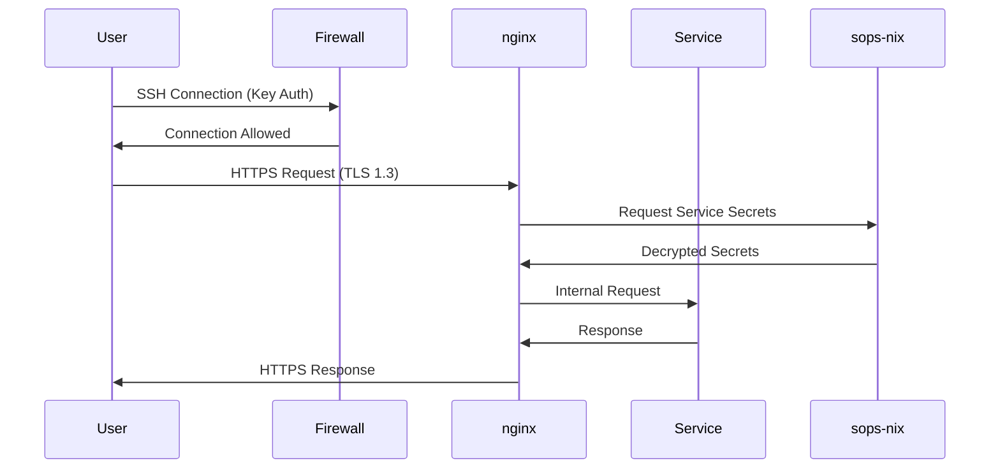

# RAVE System Architecture

## Overview

RAVE (Reproducible AI Virtual Environment) is a production-ready, security-hardened NixOS-based virtual machine designed for AI development workflows. The system implements a three-phase architecture evolution from foundation (P0) through security hardening (P1) to comprehensive observability (P2).

## System Context

### Problem Statement
AI development environments require:
- **Reproducible Infrastructure**: Consistent environments across development, staging, and production
- **Security Hardening**: Protection against common attack vectors in cloud deployments
- **Comprehensive Monitoring**: Full observability of system performance and AI agent workflows
- **Resource Discipline**: Efficient operation within constrained memory environments (SAFE mode)

### Target Users
- **AI Developers**: Building and testing AI agents and workflows
- **DevOps Engineers**: Deploying and maintaining AI infrastructure
- **Security Teams**: Ensuring secure AI system deployment
- **Operations Teams**: Monitoring and maintaining production AI services

### Design Constraints
- **Memory Discipline**: Must operate efficiently in 2GB RAM environments (SAFE=1 mode)
- **Security First**: Zero-trust security model with encrypted secrets management
- **Reproducible Builds**: 100% reproducible via Nix flakes
- **Cloud Native**: Designed for public cloud deployment with proper network isolation

## Architecture Capability Map

### C1: Infrastructure Provisioning
- **Owner**: DevOps Team
- **Success Metrics**: 
  - VM boot time < 60 seconds
  - 100% reproducible image builds
  - Memory usage < 2GB in SAFE mode
- **Boundaries**: NixOS VM configuration, Nix flake management, resource allocation

### C2: Service Management  
- **Owner**: Platform Team
- **Success Metrics**:
  - 99.9% service uptime
  - < 30s service restart time
  - All services monitored with health checks
- **Boundaries**: systemd service orchestration, nginx proxy, service dependencies

### C3: Security Controls
- **Owner**: Security Team
- **Success Metrics**:
  - Zero hardcoded secrets
  - SSH key-only authentication
  - 100% encrypted secrets with sops-nix
  - Automated security scanning with zero critical vulnerabilities
- **Boundaries**: Network perimeter, authentication, secrets management, intrusion prevention

### C4: Observability Infrastructure
- **Owner**: SRE Team
- **Success Metrics**:
  - 30-day metrics retention
  - < 30s alert response time
  - 100% service coverage with health checks
  - Distributed tracing correlation with 95% coverage
- **Boundaries**: Metrics collection, alerting, dashboard visualization, log aggregation

### C5: AI Workflow Support
- **Owner**: AI Development Team
- **Success Metrics**:
  - Multi-agent task processing
  - OpenTelemetry trace correlation
  - Webhook processing with 99.9% reliability
- **Boundaries**: Agent task execution, event processing, external API integration

### C6: CI/CD Automation
- **Owner**: Platform Team
- **Success Metrics**:
  - < 12 minutes full build pipeline
  - 21 integration test cases passing
  - Automated security scanning and vulnerability management
- **Boundaries**: Build automation, testing, security scanning, release management

## System Overview

### Runtime Topology



### Data Contracts and APIs

#### Core Data Models (Zod Schemas)

```typescript
// Agent Task Schema
const AgentTaskSchema = z.object({
  task_id: z.string(),
  trace_id: z.string(),
  agent_type: z.enum(['backend-architect', 'frontend-developer', 'ai-engineer']),
  status: z.enum(['pending', 'running', 'completed', 'failed']),
  created_at: z.string().datetime(),
  completed_at: z.string().datetime().optional(),
  metrics: z.object({
    duration_ms: z.number(),
    memory_usage_mb: z.number(),
    cpu_usage_percent: z.number()
  }).optional()
});

// Webhook Event Schema
const WebhookEventSchema = z.object({
  event_uuid: z.string().uuid(),
  event_type: z.string(),
  timestamp: z.string().datetime(),
  payload: z.record(z.unknown()),
  signature: z.string(),
  processed: z.boolean().default(false),
  task_id: z.string().optional(),
  trace_id: z.string()
});

// Metrics Schema
const MetricsSchema = z.object({
  metric_name: z.string(),
  value: z.number(),
  timestamp: z.number(),
  labels: z.record(z.string()),
  trace_id: z.string().optional()
});
```

#### API Versioning Policy
- **Semantic Versioning**: All APIs follow semver (major.minor.patch)
- **Backward Compatibility**: Major versions maintain N-1 compatibility
- **Deprecation Timeline**: 6 months notice for breaking changes
- **API Documentation**: OpenAPI 3.0 specs for all HTTP endpoints

### State Management

#### Data Lifecycle
1. **Event Ingestion**: Webhooks → SQLite event store → Processing queue
2. **Metrics Collection**: Prometheus scraping → TSDB storage → Grafana visualization  
3. **Agent Tasks**: Task creation → OpenTelemetry tracing → Completion tracking
4. **Secret Rotation**: sops-nix encrypted → systemd secret delivery → Service restart

#### Data Retention Policies
- **SAFE Mode (SAFE=1)**: 3-day metrics retention, 7-day event logs
- **FULL_PIPE Mode**: 7-day metrics retention, 30-day event logs
- **Long-term Storage**: Critical metrics exported to external systems
- **Backup Strategy**: Daily encrypted snapshots with 30-day retention

### Security Model

#### Zero-Trust Architecture
- **Identity Verification**: SSH key-based authentication only
- **Network Segmentation**: Firewall with explicit allow rules only
- **Encrypted Communications**: TLS 1.3 for all external communications
- **Secret Management**: sops-nix with age encryption for all sensitive data

#### Authentication & Authorization Flow


#### Threat Model & Mitigations
- **Network Attacks**: fail2ban IPS, rate limiting, DDoS protection
- **Authentication Bypass**: SSH key rotation, no password auth, session timeouts
- **Data Exfiltration**: Encrypted secrets, network segmentation, access logging
- **Resource Exhaustion**: Memory limits, CPU quotas, connection limits
- **Supply Chain**: Signed packages, vulnerability scanning, dependency auditing

## Code Structure (Hexagonal Architecture)

### Domain Layer (Pure Business Logic)
```
packages/domain/
├── agent-orchestration/     # AI agent coordination logic
├── task-processing/         # Task execution and state management  
├── event-streaming/         # Webhook event processing
└── metrics-collection/      # Performance data aggregation
```

### Application Layer (Use Cases)
```
apps/api/src/
├── use-cases/
│   ├── ProcessWebhookUseCase.ts
│   ├── ExecuteAgentTaskUseCase.ts
│   └── CollectMetricsUseCase.ts
├── orchestration/
│   ├── TaskOrchestrator.ts
│   └── EventProcessor.ts
└── validation/
    ├── WebhookValidator.ts
    └── SchemaValidator.ts
```

### Interface Layer (Adapters)
```
apps/api/src/
├── http/                    # HTTP endpoints and routing
├── webhooks/               # Webhook handlers
└── metrics/                # Prometheus metrics endpoints
```

### Infrastructure Layer (I/O)
```
ops/
├── nix-configurations/     # NixOS system definitions
├── secrets-management/     # sops-nix secret configuration
├── monitoring/            # Grafana dashboards and alerts
└── ci-cd/                 # GitLab CI pipeline definitions
```

## Decision Records

### Key Architectural Decisions
- **[ADR-001](adr/001-vm-build-system.md)**: NixOS VM Build System
- **[ADR-002](adr/002-p0-production-readiness-foundation.md)**: P0 Production Foundation  
- **[ADR-003](adr/003-p1-security-hardening.md)**: P1 Security Hardening
- **[ADR-004](adr/004-p2-observability-implementation.md)**: P2 Observability Implementation

### Technology Selection Rationale
- **NixOS**: Reproducible system configuration with guaranteed consistency
- **sops-nix**: Industry-standard secret management with age encryption
- **Prometheus + Grafana**: Battle-tested observability stack with extensive ecosystem
- **SQLite**: Embedded database for local event storage without external dependencies
- **nginx**: High-performance reverse proxy with extensive security features

## Quality Attributes

### Performance Targets
- **Response Time**: p99 < 200ms for all HTTP endpoints
- **Memory Usage**: < 2GB total system memory (SAFE mode)
- **CPU Utilization**: < 80% average across all cores
- **Disk I/O**: < 100MB/s sustained throughput
- **Network**: < 10MB/s sustained bandwidth

### Availability Targets
- **System Uptime**: 99.9% (< 45 minutes downtime/month)
- **Service Recovery**: < 30 seconds automatic restart
- **Data Consistency**: 100% ACID compliance for critical operations
- **Backup RTO**: < 1 hour recovery time objective
- **Backup RPO**: < 15 minutes recovery point objective

### Observability Requirements

#### RED Metrics (Rate, Errors, Duration)
- **Request Rate**: Requests per second by endpoint and status code
- **Error Rate**: Error percentage by service and error type
- **Duration**: Response time percentiles (p50, p95, p99) by endpoint

#### USE Metrics (Utilization, Saturation, Errors)
- **Utilization**: CPU, memory, disk, network utilization by service
- **Saturation**: Queue depths, connection pools, resource contention
- **Errors**: System errors, failed health checks, resource exhaustion

#### Custom Metrics
- **Agent Performance**: Task completion rate, processing duration, success ratio
- **Webhook Processing**: Event ingestion rate, deduplication ratio, processing latency
- **Security Events**: Authentication failures, rate limit violations, suspicious activities

## Testing Strategy

### Unit Testing (95% Coverage)
- **Domain Logic**: Pure functions in packages/domain with property-based testing
- **Use Cases**: Application layer with mock dependencies
- **Validation**: Schema validation and data transformation logic

### Integration Testing (21 Test Cases)
- **Service Integration**: Full systemd service stack health verification
- **HTTP Endpoints**: All REST API endpoints with proper authentication
- **Database Operations**: PostgreSQL and SQLite persistence layer testing
- **Secret Management**: sops-nix secret delivery and rotation testing

### End-to-End Testing
- **VM Deployment**: Complete P2 production image deployment and health checks
- **Security Validation**: Firewall rules, SSH configuration, TLS certificate validation
- **Monitoring Stack**: Prometheus targets, Grafana dashboards, alerting rules
- **CI/CD Pipeline**: Full build → test → scan → release workflow validation

### Security Testing
- **Vulnerability Scanning**: Trivy security scanning with CRITICAL threshold blocking
- **Dependency Auditing**: npm audit and Nix package vulnerability checks  
- **Configuration Auditing**: Hardcoded secret detection and security policy validation
- **Penetration Testing**: Quarterly external security assessments

## Risk Assessment & Mitigation

### Top 5 Technical Risks

#### Risk 1: Memory Exhaustion (High Impact, Medium Probability)
- **Description**: System OOM killing critical services during high load
- **Impact**: Complete system unavailability, data loss potential
- **Mitigation**: 
  - SAFE mode memory discipline with systemd memory limits
  - OOMScoreAdjust prioritization for critical services
  - Prometheus alerting on memory usage > 85%
  - Automatic service restart with exponential backoff

#### Risk 2: Secret Compromise (High Impact, Low Probability)  
- **Description**: sops-nix private keys or webhook secrets exposed
- **Impact**: Complete system compromise, data breach potential
- **Mitigation**:
  - Age encryption with hardware-backed keys
  - Regular secret rotation (quarterly)
  - Access logging and anomaly detection
  - Zero-trust network architecture

#### Risk 3: CI/CD Pipeline Failure (Medium Impact, Medium Probability)
- **Description**: Build pipeline failures preventing deployments
- **Impact**: Delayed releases, inability to deploy security updates
- **Mitigation**:
  - Parallel build stages with independent caching
  - Comprehensive test coverage with early failure detection
  - Manual deployment procedures as backup
  - Pipeline health monitoring and alerting

#### Risk 4: Database Corruption (High Impact, Low Probability)
- **Description**: SQLite or PostgreSQL data corruption
- **Impact**: Loss of task history, configuration, and user data
- **Mitigation**:
  - Daily encrypted backups with integrity verification
  - Database replication for PostgreSQL
  - Automated backup restoration testing
  - Database health monitoring with corruption detection

#### Risk 5: Network Isolation Failure (Medium Impact, Low Probability)
- **Description**: Firewall misconfiguration exposing internal services
- **Impact**: Unauthorized access to monitoring and administrative interfaces
- **Mitigation**:
  - Configuration testing in CI pipeline
  - Network segmentation validation in integration tests
  - Regular security audits of firewall rules
  - Intrusion detection with automated response

### Operational Risk Mitigation

#### Resource Monitoring
- **Memory Pressure**: Automated alerts at 85% usage with automatic service prioritization
- **Disk Space**: Automated cleanup of old logs and metrics data at 80% usage
- **CPU Throttling**: Load balancing and request rate limiting during high utilization
- **Network Saturation**: Traffic shaping and priority queuing for critical services

#### Security Monitoring  
- **Authentication Failures**: fail2ban automatic IP blocking after 3 failed attempts
- **Suspicious Activity**: Behavioral analysis of access patterns with alerting
- **Vulnerability Management**: Daily security scanning with automated patching
- **Incident Response**: Documented procedures for security events with escalation

#### Backup and Recovery
- **Automated Backups**: Daily encrypted snapshots with offsite storage
- **Recovery Testing**: Monthly backup restoration validation
- **Disaster Recovery**: Complete system rebuild procedures from configuration
- **Data Retention**: Automated cleanup with configurable retention policies

---

**Document Classification**: Internal Use  
**Last Updated**: 2024-12-28  
**Next Review**: 2025-03-28  
**Approval**: DevOps Lead, Security Lead, SRE Lead